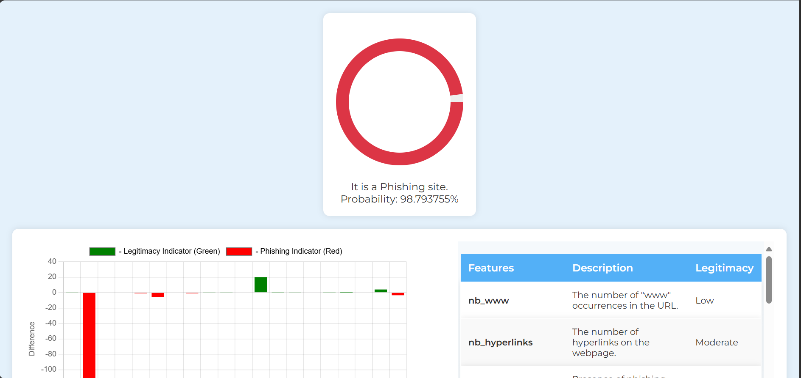
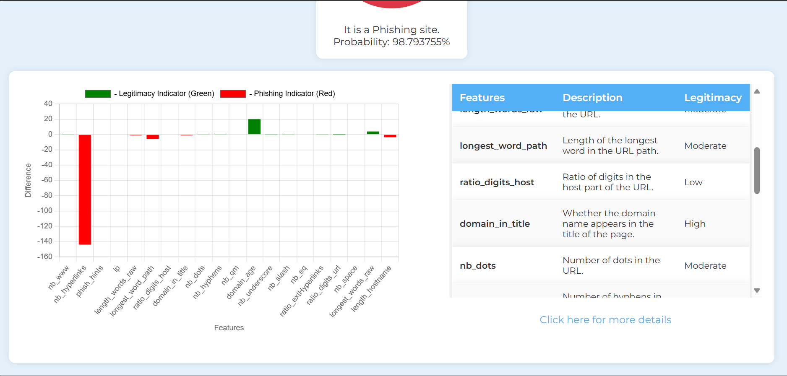
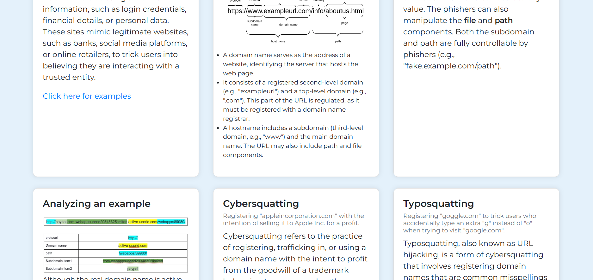
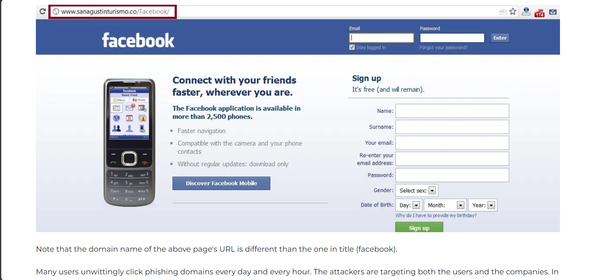
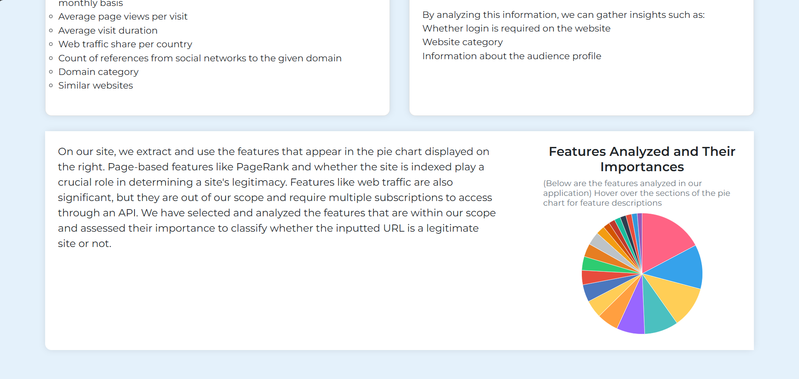

# Phishing URL Detection

A machine learning project for classifying whether an inputted URL is legitimate or phishing, along with a dynamic visualization to display the classification results.

## Table of Contents

- [Installation](#Installation)
- [Usage](#Usage)

## Installation

1. Clone the repository:
   git clone https://github.com/Tezha3/phishing-url-detection.git

2. Navigate to the project directory:
   cd phishing-url-detection

3. Install the necessary dependencies:
   pip install -r requirements.txt

## Usage
1. Run the application:
   python app.py
2. Open your browser and go to 'http://localhost:5000'.
3. Enter a URL into the input field and submit to see if it's legitimate or phishing.
   
4. On the results page:
   1. The application displays the probability of the site being legitimate or phishing.
   2. A dynamic visualization using a bar chart shows the features plotted against the difference between the extracted values and the ideal values (of a particular feature 
      for the site to be legitimate).
   3. Next to the bar chart, there is a table listing the extracted and analyzed features, along with their degree of legitimacy for a legitimate site.
      
      
5. The 'About' page provides details about phishing.
   
6. The 'Guidelines' page contains information about the features used in the prediction process, as well as other types of features that are generally used in phishing 
   detection.
   
7. A link on the 'About' page directs you to a 'Phishing Examples' page, which includes examples demonstrating phishing attempts through emails.
   
